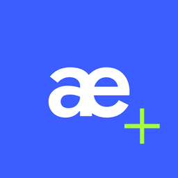

<div align="center">



# AEmulator Plus

**Les anciennes ROM Android — HTC Sense, TouchWiz, MIUI, AOSP — sur un téléphone moderne. Sans root, sans PC.**

[🇬🇧 English](../../README.md) · [🇷🇺 Русский](README.ru.md) · [🇺🇦 Українська](README.uk.md) · [🇩🇪 Deutsch](README.de.md) · **🇫🇷 Français** · [🇪🇸 Español](README.es.md) · [🇧🇷 Português](README.pt-BR.md) · [🇮🇹 Italiano](README.it.md) · [🇵🇱 Polski](README.pl.md) · [🇹🇷 Türkçe](README.tr.md) · [🇸🇦 العربية](README.ar.md) · [🇮🇷 فارسی](README.fa.md) · [🇮🇳 हिन्दी](README.hi.md) · [🇮🇩 Indonesia](README.id.md) · [🇻🇳 Tiếng Việt](README.vi.md) · [🇨🇳 简体中文](README.zh-CN.md) · [🇯🇵 日本語](README.ja.md) · [🇰🇷 한국어](README.ko.md)

</div>

---

AEmulator Plus démarre un vrai système Android 2.3–7.x directement depuis un fichier de ROM : ZIP recovery, archive Odin ou image d’usine Google. L’ancien code ARM passe par un QEMU modifié, le binder du noyau est émulé, les graphismes utilisent le GPU du téléphone et le son passe par la pile audio d’Android — le tout dans une application ordinaire.

## ✨ Fonctionnalités

- Import de presque tous les formats : ZIP CWM/TWRP, Odin `.tar.md5` de Samsung, image d’usine Google `.tgz`, `system.img`, OTA `system.new.dat.br`
- Les surcouches constructeur fonctionnent telles quelles : HTC Sense, Samsung TouchWiz, MIUI, AOSP
- Graphismes matériels via le pont GL, son, tactile et multitouch, réseau avec proxy TLS moderne
- Dossier de carte mémoire partagé pour les APK, la musique et les photos
- Interface Material 3 Expressive en 18 langues
- Gratuit et open source (GPL-3.0)

## 🚀 Démarrage rapide

1. Téléchargez l’APK depuis [Releases](https://github.com/somerandomusernam2/AEmulator-Plus/releases) et installez-le.
2. Ouvrez AEmulator Plus → **Ajouter une ROM** et choisissez le fichier. L’import prend quelques minutes.
3. Appuyez sur **Démarrer**. Le premier démarrage est plus long : le système optimise les applis.
4. Menu ⋮ pour le volume, le bouton marche et le journal ; ⚙️ ouvre les paramètres et la langue.

## 📋 Configuration requise

- Android 8.0+ sur un téléphone ARM 64 bits (arm64-v8a)
- Environ 1–3 Go libres par ROM
- Puce récente conseillée : Snapdragon / Dimensity / Tensor

## ⚙️ Fonctionnement

Chaque processus invité tourne sous un QEMU en mode utilisateur modifié. Un démon binder remplace le pilote du noyau, un pont GL transmet les appels OpenGL ES au GPU, et de petites bibliothèques invitées (HAL audio, enveloppe audio policy, shim LD_PRELOAD) adaptent le code constructeur à l’émulateur. L’importateur lit la ROM, trouve les scripts init dans l’image boot et construit le plan de démarrage des services.

## 🛠️ Compiler depuis les sources

Le build de release testé de l’application utilise JDK 21 et Android SDK 36. Voir les [instructions de compilation et de sources](../build-source.md), avec les détails de la chaîne d’outils native et de la signature. **Les binaires du moteur hérités n’ont pas encore de provenance complète vérifiée pour les sources et la compilation** ; voir [l’audit](../license-audit.md).

```bash
git clone https://github.com/somerandomusernam2/AEmulator-Plus.git
cd AEmulator-Plus
./gradlew copyReleaseApks
```

## 🙏 Remerciements

AEmulator Plus est né des émulateurs HTC Desire HD et HTC One M7 de [l’auteur d’origine](https://t.me/istratiit_ech) — sans son moteur, ce projet n’existerait pas.

Ceci est un fork modifié de [drel4/AEmulator-Sunset](https://github.com/drel4/AEmulator-Sunset), lui-même un fork modifié de [uxazu/AEmulator](https://github.com/uxazu/AEmulator).

## 🔗 Liens

- Mon fork: [somerandomusernam2/AEmulator-Plus](https://github.com/somerandomusernam2/AEmulator-Plus)
- Amont: [drel4/AEmulator-Sunset](https://github.com/drel4/AEmulator-Sunset)
- Original: [uxazu/AEmulator](https://github.com/uxazu/AEmulator)
- Auteur: [somerandomusername2](https://github.com/somerandomusernam2)
- Auteur d’origine: [t.me/istratiit_ech](https://t.me/istratiit_ech)

## 📄 Licence

GPL-3.0. Android, les marques et les ROM appartiennent à leurs propriétaires.

Voir les [avis de modification datés](../../NOTICE.md) et [l’audit des sources et des licences, encore en cours](../license-audit.md). L’étiquette GPL ne certifie pas que chaque binaire fourni dispose de l’intégralité des sources correspondantes.
